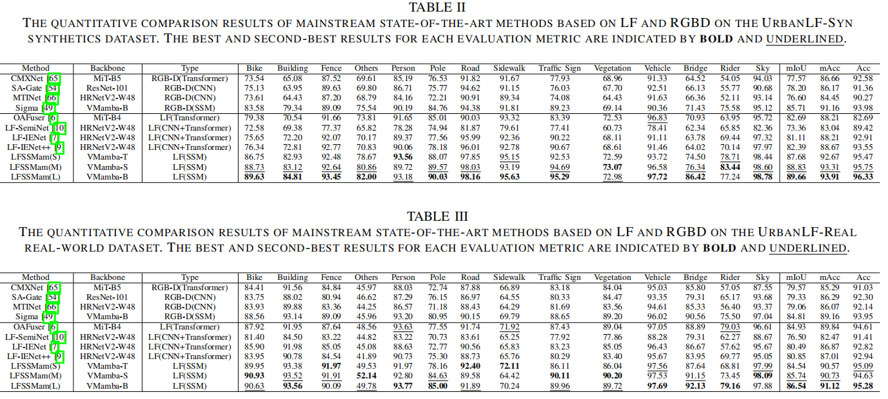

<h1> LFSSMam: Efficient Aggregation of Multi-Spatial-Angular-Modal Information in Light Field Semantic Segmentation Using Selective Scanning with SSMs </h1>

## 👀Introduction
Efficient modeling of 4D light fields for precise semantic segmentation has recently faced challenges in capturing long-range dependency information and the secondary computational complexity memory constraints, which limit the utilization of multi-spatial-angular information and the overall performance development. In this paper, we introduce LFSSMam, a novel Light Field Semantic Segmentation architecture fully based on selective structured state space model (Mamba). LFSSMam designs an innovative spatial-angular selective scanning mechanism to decouple and scan 4D multi-dimensional light field data, capturing rich spatial context, complementary angular, and structural information within the state space. Additionally, we design an SSM-based cross-fusion enhance module to perform selective scanning and fusion across multi-scale spatial-angular-modal light field information, adaptively complementing and enhancing central view features. Comprehensive experiments on both synthetic and real-world datasets demonstrate that LFSSMam achieves a leading SOTA performance (10.07\% improvement) with reduced memory and computational complexity. This work provides insightful directions for the efficient modeling and application of multi-dimensional spatial-angular information in light fields. 


## 📈Results


## 💡Environment

We test our codebase with `PyTorch 1.13.1 + CUDA 11.7`. Please install corresponding PyTorch and CUDA versions according to your computational resources. 

1. Create environment.
    ```shell
    conda create -n LFSSMam python=3.9
    conda activate LFSSMam
    ```

2. Install all dependencies.
Install pytorch, cuda and cudnn, then install other dependencies via:
    ```shell
    pip install torch==1.13.1+cu117 torchvision==0.14.1+cu117 torchaudio==0.13.1 --extra-index-url https://download.pytorch.org/whl/cu117
    ```
    ```shell
    pip install -r requirements.txt
    ```

3. Install Mamba
    ```shell
    cd models/encoders/selective_scan && pip install . && cd ../../..
    ```

## ⏳Setup

### Datasets

1. We use UrbanLF datasets, including both UrbanLF_Real and UrbanLF_Syn.

    Note: The central and peripheral views need to be extracted from the original data set and grayscale values processed on RGB labels

2. We provide the processed datasets we use here（only UrbanLF_Syn）: [UrbanLF_Syn_processed](https://ufile.io/0o862owh)

3. If you are using your own datasets, please orgnize the dataset folder in the following structure:
    ```shell
    <datasets>
    |-- <DatasetName1>
        |-- <DepthFolder>
            |-- <name1>.<ModalXFormat>
            |-- <name2>.<ModalXFormat>
            ...
        |-- <RGBFolder>
            |-- <name1>.<ModalXFormat>
            |-- <name2>.<ModalXFormat>
            ...
        |-- <LFFolder>
            |-- <name1Folder>
               |-- <Image1>.<Image1Format>
               |-- <Image2>.<Image2Format>
               ...
            |-- <name2Folder>
        |-- <LabelFolder>
            |-- <name1>.<LabelFormat>
            |-- <name2>.<LabelFormat> 
            ...
        |-- train.txt
        |-- test.txt
    |-- <DatasetName2>
    |-- ...
    ```

    `train.txt/test.txt` contains the names of items in training/testing set, e.g.:

    ```shell
    <name1>
    <name2>
    ...
    ```

### Training

We will fully release the training process and code after acceptance.

### Evaluation

Currently, we only publicly release the optimal trained weights for UrbanLF_Syn.

1.Please download the pretrained [VMamba](https://github.com/MzeroMiko/VMamba) weights:

- [VMamba_Tiny](https://github.com/MzeroMiko/VMamba/releases/download/%2320240218/vssmtiny_dp01_ckpt_epoch_292.pth).
- [VMamba_Small](https://github.com/MzeroMiko/VMamba/releases/download/%2320240218/vssmsmall_dp03_ckpt_epoch_238.pth).
- [VMamba_Base](https://github.com/MzeroMiko/VMamba/releases/download/%2320240218/vssmbase_dp06_ckpt_epoch_241.pth).

<u> Please put them under `pretrained/vmamba/`. </u>

2.Run the evaluation by:
   ```shell
    CUDA_VISIBLE_DEVICES="0/1/2/3/..." python eval.py -d="0" -n "dataset_name" -e="epoch_number" -p="visualize_savedir"
   ```

Here, `dataset_name=UbanLF_Real/UrbanLF_Syn`, referring to the datasets.\
`epoch_number` refers to a number standing for the epoch number you want to evaluate with.\
We provide the best `epoth.pth` of UrbanLF_Syn in the [UrbanLF_Syn_base_best](https://ufile.io/5k59uj0p)/[UrbanLF_Syn_small_best](https://www.hostize.com/zh/v/223WMxfoVq)/[UrbanLF_Syn_tiny_best](https://www.hostize.com/zh/v/u8dsZBxh3p).\
You can replace `epoch_number` with `.log_final/log_UrbanLF_Syn/epoth.pth`

3.Results will be saved in `visualize_savedir` and `visualize_savedir_color` folders.
